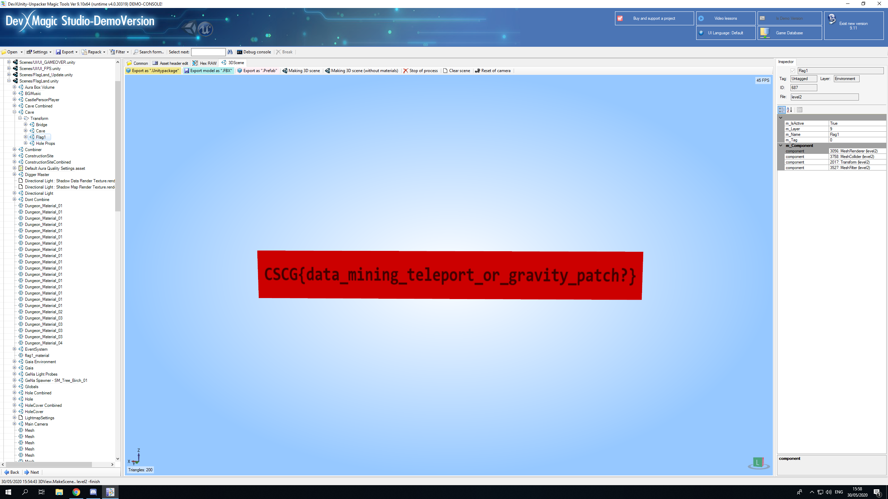

# Follow The White Rabbit - Cave

**Author**: `Managarmr`

## Table of Contents

1. [Challenge](#1-challenge)
2. [Having a look](#2-having-a-look)
3. [Unpacking the game](#3-unpacking-the-game)
4. [Mitigations](#4-mitigations)

## 1. Challenge

**Category**: `Gamehax`  
**Difficulty**: `Easy`  
**Author**: `LiveOverflow`  
**Attachments**: [FollowWhiteRabbit.zip](https://static.allesctf.net/challenges/de014dbc74a4f708b4e30e3c58d0fa20824f967e2d63a95d39466cafbbad17f0/FollowWhiteRabbit.zip)  
**Description**:

Follow the white rabbit... into the hole.
[Game Trailer](https://www.youtube.com/watch?v=IhLBamqn_5Q)

## 2. Having a look

The zip file contains a `Unity` game:

```
$ unzip -l FollowWhiteRabbit.zip
Archive:  FollowWhiteRabbit.zip
  Length      Date    Time    Name
---------  ---------- -----   ----
        0  2020-03-29 06:02   FollowWhiteRabbit/
   650752  2020-02-24 02:03   FollowWhiteRabbit/FollowWhiteRabbit.exe
        0  2020-03-29 06:02   FollowWhiteRabbit/FollowWhiteRabbit_Data/
[...Snip...]
        0  2020-03-29 06:02   FollowWhiteRabbit/MonoBleedingEdge/
        0  2020-03-29 06:02   FollowWhiteRabbit/MonoBleedingEdge/EmbedRuntime/
  4955592  2020-02-24 02:04   FollowWhiteRabbit/MonoBleedingEdge/EmbedRuntime/mono-2.0-bdwgc.dll
   780288  2020-02-24 01:58   FollowWhiteRabbit/MonoBleedingEdge/EmbedRuntime/MonoPosixHelper.dll
        0  2020-03-29 06:02   FollowWhiteRabbit/MonoBleedingEdge/etc/
[...Snip...]
  1094088  2020-02-24 02:04   FollowWhiteRabbit/UnityCrashHandler64.exe
 25750472  2020-02-24 02:04   FollowWhiteRabbit/UnityPlayer.dll
---------                     -------
478781577                     178 files
```

There are tools for this kind of game, one of them being `DevX Magic Studio`, so
let's have a look at the game. (I didn't even bother starting it as I figured I
want to see everything anyway and the tool renders everything, so why even
bother?)

## 3. Unpacking the game

Opening it in `DevX Magic Studio` we can have a loot at all the objects and even
render scenes - one of them being called `FlagLand`. This scene contains a
`Cave` element, which is a transform of `Bridge`, `Cave`, `Flag1` and
`Hole Props` - and true enough, rendering `Flag1` yields the flag:
`CSCG{data_mining_teleport_or_gravity_patch}`



## 4. Mitigations

There isn't really a mitigation to this. One could make it harde by using a
custom engine with custom formats and obfuscate everthing - that does not make
it more secure though, just more obnoxious.
