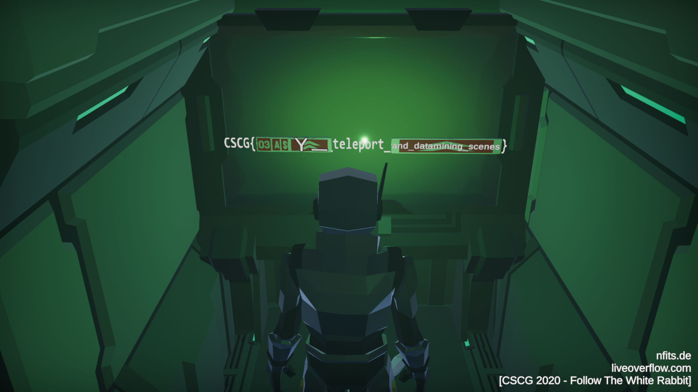

# Follow The White Rabbit - Datamining

**Author**: `Managarmr`

## Table of Contents

1. [Challenge](#1-challenge)
2. [Having a look](#2-having-a-look)
3. [Unpacking the game](#3-unpacking-the-game)
4. [Patching the game](#4-patching-the-game)
5. [Mitigations](#4-mitigations)

## 1. Challenge

**Category**: `Gamehax`  
**Difficulty**: `Hard`  
**Author**: `LiveOverflow`  
**Attachments**: [FollowWhiteRabbit.zip](https://static.allesctf.net/challenges/de014dbc74a4f708b4e30e3c58d0fa20824f967e2d63a95d39466cafbbad17f0/FollowWhiteRabbit.zip)  
**Description**:

It looks like the prison is still under construction on the currently shipped
game... But I heard somebody figured out, that early parts of the unreleased
content accidentally leaked into this release! Can you find it and follow the
white rabbit? [Game Trailer](https://www.youtube.com/watch?v=IhLBamqn_5Q)

## 2. Having a look

The zip file contains a `Unity` game:

```
$ unzip -l FollowWhiteRabbit.zip
Archive:  FollowWhiteRabbit.zip
  Length      Date    Time    Name
---------  ---------- -----   ----
        0  2020-03-29 06:02   FollowWhiteRabbit/
   650752  2020-02-24 02:03   FollowWhiteRabbit/FollowWhiteRabbit.exe
        0  2020-03-29 06:02   FollowWhiteRabbit/FollowWhiteRabbit_Data/
[...Snip...]
        0  2020-03-29 06:02   FollowWhiteRabbit/MonoBleedingEdge/
        0  2020-03-29 06:02   FollowWhiteRabbit/MonoBleedingEdge/EmbedRuntime/
  4955592  2020-02-24 02:04   FollowWhiteRabbit/MonoBleedingEdge/EmbedRuntime/mono-2.0-bdwgc.dll
   780288  2020-02-24 01:58   FollowWhiteRabbit/MonoBleedingEdge/EmbedRuntime/MonoPosixHelper.dll
        0  2020-03-29 06:02   FollowWhiteRabbit/MonoBleedingEdge/etc/
[...Snip...]
  1094088  2020-02-24 02:04   FollowWhiteRabbit/UnityCrashHandler64.exe
 25750472  2020-02-24 02:04   FollowWhiteRabbit/UnityPlayer.dll
---------                     -------
478781577                     178 files
```

There are tools for this kind of game, one of them being `DevX Magic Studio`, so
let's have a look at the game. (I didn't even bother starting it as I figured I
want to see everything anyway and the tool renders everything, so why even
bother?)

## 3. Unpacking the game

Opening it in `DevX Magic Studio` we can have a loot at all the objects and even
render scenes - one of them being called `FlagLand_Update`. This must be the
scene the description refers to. Rendering the scene we can see what looks
like a flag display, but there's no text and the textures seem wrong. So let's
try loading it.

## 4. Patching the game

As we want to load the scene we should start looking for code which loads the
menu scenes as this is probably the easiest to hijack. After looking around
for a bit, we can see that the `UILoader.cs` does just that - so let's add
another `if`-statement:

```csharp
if (UnityEngine.Input.GetKeyDown(KeyCode.F3)) {
	if (!SceneManager.GetSceneByName("FlagLand_Update").isLoaded) {
		SceneManager.LoadSceneAsync("FlagLand_Update",
		                            LoadSceneMode.Additive);
	} else {
		SceneManager.UnloadSceneAsync("FlagLand_Update");
	}
}
```

Starting the game and wandering around we can see that pressing `F3` loads and
unloads a house - nice. But there is no way to reach it. We have to patch in a
small fly hack as well.

This can be done by adding another input called `DescendInput` to
`PlayerInput.cs` and binding it to shift:

```csharp
public bool DescendInput
{
	get {
		return this.m_Descend;
	}
}

// this.m_Descend = UnityEngine.Input.GetKey(KeyCode.LeftShift);
```

Now the only function left that needs patching is the
`CalculateVerticalMovement` function in `PlayerController.cs`, resulting in:

```csharp
private void CalculateVerticalMovement()
{
	if (this.m_Input.JumpInput) {
		this.m_VerticalSpeed = this.jumpSpeed;
	} else if (this.m_input.DescendInput) {
		this.m_VerticalSpeed = -this.jumpSpeed;
	} else {
		this.m_VerticalSpeed = 0f;
	}

	this.m_Animator.SetFloat(this.m_HashVerticalSpeed, this.m_VerticalSpeed);
}
```

We can now load the house, fly towards it, unload it in order to walk through
the wall and load it again, resulting in the flag:
`CSCG{03ASY_teleport_and_datamining_scenes}`



## 5. Mitigations

There isn't really a mitigation to this. One could make it harde by using a
custom engine with custom formats and obfuscate everthing - that does not make
it more secure though, just more obnoxious. Well you could also not leak data
you wish to keep private in public releases ;)
