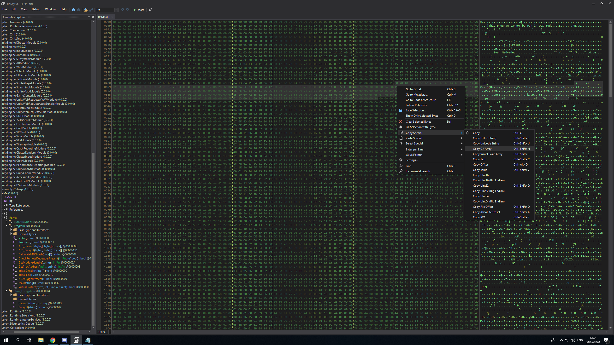

# reme Part 2

**Author**: `Managarmr`

## Table of Contents

1. [Challenge](#1-challenge)
2. [Having a look](#2-having-a-look)
3. [Cracking the inner DLL](#3-cracking-the-inner-dll)
4. [Mitigations](#4-mitigations)

## 1. Challenge

**Category**: `Reverse Engineering`  
**Difficulty**: `Medium`  
**Author**: `0x4d5a`  
**Attachments**: [ReMe.dll](https://static.allesctf.net/challenges/e5971550aac869a054b67c9823148cf90470f7463de6a6cbb45f184d50845519/ReMe.dll)
[ReMe.deps.json](https://static.allesctf.net/challenges/9be7b4ca4a698158d6fbc53cd88a5d83d65cd3ccbd1a83728aca2418263dfd8d/ReMe.deps.json)
[ReMe..runtimeconfig.json](https://static.allesctf.net/challenges/9ada7e7cabd6ad48ea6781e31fd6b30eab772558744fc996d9523c7b0e04e9e9/ReMe.runtimeconfig.json)  
**Description**:

.NET Reversing can't be that hard, right? But I've got some twists waiting for you 😈

Execute with .NET Core Runtime 2.2 with windows, e.g. dotnet ReMe.dll

## 2. Having a look

In this challenge we are provided with a `DLL`. Looking at it in `dnSpy` we
can see that if tries to unpack an inner `DLL` and execute it. We can just grab
the `key` and `payload` bytes using `dnSpy` and decrypt it using an online tool
such as https://dotnetfiddle.net:



```csharp
public static byte[] AES_Decrypt(byte[] bytesToBeDecrypted, byte[] passwordBytes)
{
	byte[] result = null;
	byte[] array = new byte[] {1, 2, 3, 4, 5, 6, 7, 8};
	using (MemoryStream memoryStream = new MemoryStream()) {
		using (RijndaelManaged rijndaelManaged = new RijndaelManaged()) {
			rijndaelManaged.KeySize = 256;
			rijndaelManaged.BlockSize = 128;
			Rfc2898DeriveBytes rfc2898DeriveBytes =
				new Rfc2898DeriveBytes(passwordBytes, array, 1000);
			rijndaelManaged.Key = rfc2898DeriveBytes.GetBytes(rijndaelManaged.KeySize / 8);
			rijndaelManaged.IV = rfc2898DeriveBytes.GetBytes(rijndaelManaged.BlockSize / 8);
			rijndaelManaged.Mode = 1;
			using (CryptoStream cryptoStream = new CryptoStream(memoryStream, rijndaelManaged.CreateDecryptor(), 1)) {
				cryptoStream.Write(bytesToBeDecrypted, 0, bytesToBeDecrypted.Length);
				cryptoStream.Close();
			}
			result = memoryStream.ToArray();
		}
	}
	return result;
}
```

After dumping the inner `DLL` cracking it is trivial.

## 3. Cracking the inner DLL

The inner `DLL` checks the flag in a very simple way:

```csharp
"CSCG{" + array[0] == "CSCG{n0w" && array[1] == "u" && array[2] == "know" && array[3] == "st4t1c" && array[4] == "and" && Inner.CalculateMD5Hash(array[5]).ToLower() == "b72f3bd391ba731a35708bfd8cd8a68f" && array[6] == "dotNet" && array[7] + "}" == "R3333}"
```

With `b72f3bd391ba731a35708bfd8cd8a68f` being the `MD5` hash of `dynamic` the
flag is: `CSCG{n0w_u_know_st4t1c_and_dynamic_dotNet_R3333}`

## 4. Mitigations

There is no point in talking about mitigation in reversing challenges.
Although you could hash the whole flag.
