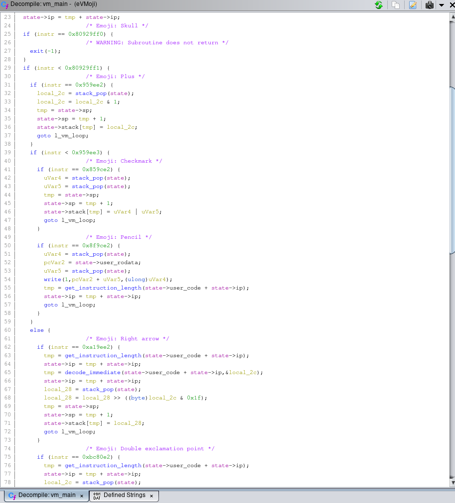

# eVMoji

**Author**: `Managarmr`

## Table of Contents

1. [Challenge](#1-challenge)
2. [Having a look](#2-having-a-look)
3. [Reversing the VM](#3-reversing-the-vm)
4. [Transpiler / VM](#4-transpiler--vm)
5. [First part](#5-first-part)
6. [Second part](#6-second-part)
7. [Final exploit](#7-final-exploit)
8. [Mitigations](#8-mitigations)

## 1. Challenge

**Category**: `Reverse Engineering`  
**Difficulty**: `Hard`  
**Author**: `0x4d5a`  
**Attachments**: [eVMoji.zip](https://static.allesctf.net/challenges/328229e0ebbc529783f2c0057ad82e642b32b22204e3b2857da7a5b464443d9f/eVMoji.zip)  
**Description**:

EMOJI HYPE 🔥💯

## 2. Having a look

Upon checking the zip file we received we can see that a binary and some data
was provided to us:

```
$ unzip -l eVMoji.zip
Archive:  eVMoji.zip
  Length      Date    Time    Name
---------  ---------- -----   ----
    10216  2020-03-12 22:39   eVMoji
    19011  2020-03-11 01:02   code.bin
---------                     -------
    29227                     2 files
```

From the name of the challenge we can already assume that this is a `VM`
reversing challenge. Checking out the `code.bin` we are greeted with the
abomination that is custom emoji code. 

## 3. Reversing the VM

Looking at the binary in `Ghidra` we can see that the `main()` function does
nothing besides reading the code and passing the data - which obviously must be
a struct by the way it is used - to a 'real main':

```c
int main(int argc,char **argv)

{
  FILE *__stream;
  
  if (argc < 2) {
    puts("Usage: ./eVMoji <code.bin>");
  }
  _DAT_00302040 = 0;
  _DAT_00302058 = 0;
  DAT_00302048 = malloc(0x400);
  _DAT_00302050 = malloc(0x400);
  DAT_00302060 = malloc(0x10000);
  __stream = fopen(argv[1],"rb");
  if (__stream == NULL) {
    printf("File not found: %s",argv[1]);
  }
  fread(DAT_00302048,0x200,1,__stream);
  fread(DAT_00302060,0x10000,1,__stream);
  fclose(__stream);
  FUN_00100bc4((int *)&DAT_00302040);
  return 0;
}
```

This 'real main' looks really ugly though, sadly.


Well after defining the struct and some reversing we can infer the meanings and
types of struct members, resulting in the following final struct:

```c
struct vm_state {
	int32_t    ip;
	int32_t    pad0;
	char *     data;
	uint32_t * stack;
	int32_t    sp;
	int32_t    pad1;
	char *     code;
};
```

Struct packing doesn't matter, right?


After retyping and reversing some function the program looks pretty nice
actually:

```c
uint32_t stack_pop(vm_state *param_1)

{
  param_1->sp = param_1->sp + -1;
  return param_1->stack[param_1->sp];
}
```

```c
int decode_immediate(char *arg0,uint *immediate)

{
  int tmp;
  long in_FS_OFFSET;
  double res;
  char op_2;
  char op_1;
  int imm_len;
  int local_14;
  long local_10;
  
  local_10 = *(long *)(in_FS_OFFSET + 0x28);
  *immediate = 0;
  imm_len = 0;
  local_14 = 0;
  while (local_14 < 3) {
    tmp = decode_number(arg0 + imm_len,&op_2);
    imm_len = imm_len + (char)tmp;
    tmp = decode_number(arg0 + imm_len,&op_1);
    imm_len = imm_len + (char)tmp;
    res = pow((double)(int)op_1,(double)(int)op_2);
    *immediate = (uint)(long)((double)(ulong)*immediate + res);
    local_14 = local_14 + 1;
  }
  if (local_10 == *(long *)(in_FS_OFFSET + 0x28)) {
    return imm_len;
  }
                    /* WARNING: Subroutine does not return */
  __stack_chk_fail();
}
```



We can now tell that this is a stack based VM with some basic operations - time
to write our own implementation with transpile support!

## 4. Transpiler / VM

Armes with the decompiled code we can develop our `VM` with transpile mode in
python:

```python
#!/usr/bin/env python3
from pwn import *


class VM(object):
	_code = bytearray()
	_data = bytearray()
	__data = bytearray()

	_input = bytearray()

	_run_flag = False
	_silent_mode = True
	_verbose_mode = False
	_transpile_mode = False

	ip = 0

	def __init__(self, code, data):
		self._code = code.decode('UTF-8')
		self.__data = data

		self.OPCODES = {
			'💪': self.push_immediate,
			'✏': self.write,
			'📖': self.read,
			'🦾': self.push_data_byte,
			'🔀': self.xor,
			'✅': self.or_,
			'🤔': self.je,
			'💀': self.exit,
			'🌠': self.push_data_long,
			'‼': self.duplicate,
			'➕': self.bitmask,
			'➡': self.shift
		}

	def reset(self):
		self._data[:] = self.__data
		self._stack = []
		self._run_flag = True

		self.ip = 0

	def _run(self):
		while self._run_flag and self.ip < len(self._code):
			opcode = self._code[self.ip]
			if opcode not in self.OPCODES:
				log.warning(f'Unimplemented opcode: {opcode}')
				self._run_flag = False
				continue

			self.OPCODES[opcode](self.ip)

	def run(self, input=b'', silent=True, verbose=False):
		self.reset()
		self._input = input
		self._silent_mode = silent
		self._verbose_mode = verbose
		self._transpile_mode = False
		self._run()

	def transpile(self):
		self.reset()
		self._transpile_mode = True
		self._run()

	# Helper functions

	def to_virt_addr(self, real_addr):
		return len(self._code[:real_addr].encode('UTF-8'))

	def to_real_addr(self, virt_addr):
		return len(self._code.encode('utf-8')[:virt_addr].decode('utf-8'))

	def push(self, val):
		self._stack.append(val)

	def pop(self):
		if (len(self._stack) == 0):
			log.warning('Attempt to pop from empty stack')
			raise IndexError()

		val = self._stack[-1]
		self._stack = self._stack[:-1]
		return val

	def decode_immediate(self):
		res = 0
		for _ in range(0, 3):
			y = self._code[self.ip]
			x = self._code[self.ip + 3]
			self.ip += 6
			res += int(int(x) ** int(y))
		return res

	# Opcodes

	def push_immediate(self, address):
		self.ip += 1

		imm = self.decode_immediate()
		self.push(imm)

		if self._transpile_mode or self._verbose_mode:
			log.info(f'{address:04x}\tpushil  {imm:08x}')

	def write(self, address):
		self.ip += 2

		size = self.pop()
		str_pos = self.pop()

		if self._transpile_mode or self._verbose_mode:
			log.info(f'{address:04x}\twrite   data[{hex(str_pos)}]:{hex(size)}')
		
		if not self._silent_mode and not self._transpile_mode:
			log.success('> ' + self._data[str_pos:str_pos + size].decode('UTF-8'))

	def read(self, address):
		self.ip += 1

		size = self.pop()
		buf_pos = self.pop()

		if self._transpile_mode or self._verbose_mode:
			log.info(f'{address:04x}\tread    data[{hex(buf_pos)}]:{hex(size)}')
		
		if not self._transpile_mode:
			read_size = len(self._input)
			read_size = size if size < read_size else read_size
			self._data[buf_pos:buf_pos + read_size] = self._input[:read_size]
			
			if not self._silent_mode:
				log.success(f'< {self._input[:read_size]}')

	def push_data_byte(self, address):
		self.ip += 1

		imm = self.decode_immediate()
		val = self._data[imm]

		self.push(val)

		if self._transpile_mode:
			log.info(f'{address:04x}\tpushb   data[{hex(imm)}]')
		elif self._verbose_mode:
			log.info(f'{address:04x}\tpushb   {val:02x}')

	def xor(self, address):
		self.ip += 1

		op1 = self.pop()
		op2 = self.pop()
		res = op1 ^ op2
		self.push(res)

		if self._transpile_mode:
			log.info(f'{address:04x}\txor')
		elif self._verbose_mode:
			char = ''
			try:
				char = f' ({chr(res)})'
			except:
				pass
			log.info(f'{address:04x}\txor     {op1:08x}, {op2:08x} # {res:08x}{char}')

	def or_(self, address):
		self.ip += 1

		op1 = self.pop()
		op2 = self.pop()
		res = op1 | op2
		self.push(res)

		if self._transpile_mode:
			log.info(f'{address:04x}\tor')
		elif self._verbose_mode:
			log.info(f'{address:04x}\tor      {op1:08x}, {op2:08x} # {res:08x}')

	def je(self, address):
		self.ip += 1

		imm = self.decode_immediate()
		dst = self.to_virt_addr(self.ip) + imm
		real_dst = self.to_real_addr(dst)

		op1 = self.pop()
		op2 = self.pop()

		if self._transpile_mode:
			log.info(f'{address:04x}\tje      {real_dst:04x}\n\n')
		elif self._verbose_mode:
			log.info(f'{address:04x}\tje      {real_dst:04x} # {op1:08x} == {op2:08x}')

		if not self._transpile_mode and op1 == op2:
			self.ip = real_dst

	def exit(self, address):
		self.ip += 1

		if self._transpile_mode or self._verbose_mode:
			log.info(f'{address:04x}\texit\n\n')
		
		if not self._transpile_mode:
			self._run_flag = False

	def push_data_long(self, address):
		self.ip += 1

		imm = self.decode_immediate()
		val = u32(self._data[imm:imm + 4])
		self.push(val)

		if self._transpile_mode:
			log.info(f'{address:04x}\tpushl   data[{hex(imm)}]')
		elif self._verbose_mode:
			log.info(f'{address:04x}\tpushl   {val:08x}')

	def duplicate(self, address):
		self.ip += 2

		op = self.pop()
		self.push(op)
		self.push(op)

		if self._transpile_mode:
			log.info(f'{address:04x}\tdupl')
		elif self._transpile_mode:
			log.info(f'{address:04x}\tdupl    # {op:08x}')

	def bitmask(self, address):
		self.ip += 1

		op = self.pop()
		self.push(op & 1)

		if self._transpile_mode:
			log.info(f'{address:04x}\tbitmask')
		elif self._transpile_mode:
			log.info(f'{address:04x}\tbitmask # {op:08x} => {op&1}')

	def shift(self, address):
		self.ip += 2

		imm = self.decode_immediate()

		op = self.pop()
		res = op >> (imm & 0x1f)
		self.push(res)

		if self._transpile_mode:
			log.info(f'{address:04x}\tshr     {imm & 0x1f}')
		elif self._verbose_mode:
			log.info(f'{address:04x}\tshr     {imm & 0x1f} # {op:08x} => {res:08x}')
```

## 5. First part

Armed with our shiny new `VM`/transpiler we can easily obtain the first part
of the flag by running the eVMoji code without providing any input in verbose
mode:

```python
#!/usr/bin/env python3
from vm import VM

file = open('./code.bin', 'rb')
data = file.read(0x200)
code = file.read()
file.close()

vm = VM(code, data)
vm.run(verbose=True)
```

This produces the following output:

```
$ ./solve.py
[*] 0000    pushil  00000090
[*] 0013    pushil  00000017
[*] 0026    write   data[0x90]:0x17
[*] 0028    pushil  000000a7
[*] 003b    pushil  00000014
[*] 004e    write   data[0xa7]:0x14
[*] 0050    pushil  00000000
[*] 0063    pushil  0000001b
[*] 0076    read    data[0x0]:0x1b
[*] 0077    pushil  00000000
[*] 008a    pushil  000000f2
[*] 009d    pushb   00
[*] 00b0    xor     00000000, 000000f2 # 000000f2 (ò)
[*] 00b1    pushil  0000009c
[*] 00c4    xor     0000009c, 000000f2 # 0000006e (n)
[*] 00c5    or      0000006e, 00000000 # 0000006e
[*] 00c6    pushil  000000ea
[*] 00d9    pushb   00
[*] 00ec    xor     00000000, 000000ea # 000000ea (ê)
[*] 00ed    pushil  000000d9
[*] 0100    xor     000000d9, 000000ea # 00000033 (3)
[*] 0101    or      00000033, 0000006e # 0000007f
[*] 0102    pushil  00000082
[*] 0115    pushb   00
[*] 0128    xor     00000000, 00000082 # 00000082 ()
[*] 0129    pushil  000000f5
[*] 013c    xor     000000f5, 00000082 # 00000077 (w)
[*] 013d    or      00000077, 0000007f # 0000007f
[*] 013e    pushil  00000036
[*] 0151    pushb   00
[*] 0164    xor     00000000, 00000036 # 00000036 (6)
[*] 0165    pushil  00000069
[*] 0178    xor     00000069, 00000036 # 0000005f (_)
[*] 0179    or      0000005f, 0000007f # 0000007f
[*] 017a    pushil  0000008e
[*] 018d    pushb   00
[*] 01a0    xor     00000000, 0000008e # 0000008e ()
[*] 01a1    pushil  000000ef
[*] 01b4    xor     000000ef, 0000008e # 00000061 (a)
[*] 01b5    or      00000061, 0000007f # 0000007f
[*] 01b6    pushil  00000012
[*] 01c9    pushb   00
[*] 01dc    xor     00000000, 00000012 # 00000012 (\x12
[*] 01dd    pushil  00000075
[*] 01f0    xor     00000075, 00000012 # 00000067 (g)
[*] 01f1    or      00000067, 0000007f # 0000007f
[*] 01f2    pushil  00000018
[*] 0205    pushb   00
[*] 0218    xor     00000000, 00000018 # 00000018 (\x18
[*] 0219    pushil  0000002b
[*] 022c    xor     0000002b, 00000018 # 00000033 (3)
[*] 022d    or      00000033, 0000007f # 0000007f
[*] 022e    pushil  00000073
[*] 0241    pushb   00
[*] 0254    xor     00000000, 00000073 # 00000073 (s)
[*] 0255    pushil  0000002c
[*] 0268    xor     0000002c, 00000073 # 0000005f (_)
[*] 0269    or      0000005f, 0000007f # 0000007f
[*] 026a    pushil  0000007b
[*] 027d    pushb   00
[*] 0290    xor     00000000, 0000007b # 0000007b ({)
[*] 0291    pushil  0000000d
[*] 02a4    xor     0000000d, 0000007b # 00000076 (v)
[*] 02a5    or      00000076, 0000007f # 0000007f
[*] 02a6    pushil  00000011
[*] 02b9    pushb   00
[*] 02cc    xor     00000000, 00000011 # 00000011 (\x11
[*] 02cd    pushil  00000020
[*] 02e0    xor     00000020, 00000011 # 00000031 (1)
[*] 02e1    or      00000031, 0000007f # 0000007f
[*] 02e2    pushil  0000005b
[*] 02f5    pushb   00
[*] 0308    xor     00000000, 0000005b # 0000005b ([)
[*] 0309    pushil  00000029
[*] 031c    xor     00000029, 0000005b # 00000072 (r)
[*] 031d    or      00000072, 0000007f # 0000007f
[*] 031e    pushil  00000069
[*] 0331    pushb   00
[*] 0344    xor     00000000, 00000069 # 00000069 (i)
[*] 0345    pushil  0000001d
[*] 0358    xor     0000001d, 00000069 # 00000074 (t)
[*] 0359    or      00000074, 0000007f # 0000007f
[*] 035a    pushil  00000038
[*] 036d    pushb   00
[*] 0380    xor     00000000, 00000038 # 00000038 (8)
[*] 0381    pushil  0000004d
[*] 0394    xor     0000004d, 00000038 # 00000075 (u)
[*] 0395    or      00000075, 0000007f # 0000007f
[*] 0396    pushil  0000008a
[*] 03a9    pushb   00
[*] 03bc    xor     00000000, 0000008a # 0000008a ()
[*] 03bd    pushil  000000be
[*] 03d0    xor     000000be, 0000008a # 00000034 (4)
[*] 03d1    or      00000034, 0000007f # 0000007f
[*] 03d2    pushil  000000b0
[*] 03e5    pushb   00
[*] 03f8    xor     00000000, 000000b0 # 000000b0 (°)
[*] 03f9    pushil  000000dc
[*] 040c    xor     000000dc, 000000b0 # 0000006c (l)
[*] 040d    or      0000006c, 0000007f # 0000007f
[*] 040e    pushil  0000008b
[*] 0421    pushb   00
[*] 0434    xor     00000000, 0000008b # 0000008b ()
[*] 0435    pushil  000000e2
[*] 0448    xor     000000e2, 0000008b # 00000069 (i)
[*] 0449    or      00000069, 0000007f # 0000007f
[*] 044a    pushil  0000008e
[*] 045d    pushb   00
[*] 0470    xor     00000000, 0000008e # 0000008e ()
[*] 0471    pushil  000000f4
[*] 0484    xor     000000f4, 0000008e # 0000007a (z)
[*] 0485    or      0000007a, 0000007f # 0000007f
[*] 0486    pushil  00000083
[*] 0499    pushb   00
[*] 04ac    xor     00000000, 00000083 # 00000083 ()
[*] 04ad    pushil  000000b7
[*] 04c0    xor     000000b7, 00000083 # 00000034 (4)
[*] 04c1    or      00000034, 0000007f # 0000007f
[*] 04c2    pushil  000000f6
[*] 04d5    pushb   00
[*] 04e8    xor     00000000, 000000f6 # 000000f6 (ö)
[*] 04e9    pushil  00000082
[*] 04fc    xor     00000082, 000000f6 # 00000074 (t)
[*] 04fd    or      00000074, 0000007f # 0000007f
[*] 04fe    pushil  000000c4
[*] 0511    pushb   00
[*] 0524    xor     00000000, 000000c4 # 000000c4 (Ä)
[*] 0525    pushil  000000f5
[*] 0538    xor     000000f5, 000000c4 # 00000031 (1)
[*] 0539    or      00000031, 0000007f # 0000007f
[*] 053a    pushil  00000039
[*] 054d    pushb   00
[*] 0560    xor     00000000, 00000039 # 00000039 (9)
[*] 0561    pushil  00000056
[*] 0574    xor     00000056, 00000039 # 0000006f (o)
[*] 0575    or      0000006f, 0000007f # 0000007f
[*] 0576    pushil  000000f5
[*] 0589    pushb   00
[*] 059c    xor     00000000, 000000f5 # 000000f5 (õ)
[*] 059d    pushil  0000009b
[*] 05b0    xor     0000009b, 000000f5 # 0000006e (n)
[*] 05b1    or      0000006e, 0000007f # 0000007f
[*] 05b2    pushil  000000a2
[*] 05c5    pushb   00
[*] 05d8    xor     00000000, 000000a2 # 000000a2 (¢)
[*] 05d9    pushil  000000fd
[*] 05ec    xor     000000fd, 000000a2 # 0000005f (_)
[*] 05ed    or      0000005f, 0000007f # 0000007f
[*] 05ee    pushil  00000000
[*] 0601    je      063d # 00000000 == 0000007f
[*] 0614    pushil  000000bb
[*] 0627    pushil  00000019
[*] 063a    write   data[0xbb]:0x19
[*] 063c    exit
```

The first part being: `n3w_ag3_v1rtu4liz4t1on_`

## 6. Second part

Looking at the second part in verbose mode we can see some interesting contants:

```
$ ./solve.py
[...snip...]
[*] 05ee    pushil  00000000
[*] 0601    je      063d # 00000000 == 00000000
[*] 063d    pushl   ffffffff
[*] 0653    pushl   00000000
[*] 0666    shr     0 # 00000000 => 00000000
[*] 067b    je      06ef # 00000000 == 00000001
[*] 068e    shr     1 # ffffffff => 7fffffff
[*] 06a2    pushl   edb88320
[*] 06b5    xor     edb88320, 7fffffff # 92477cdf
[*] 06b6    pushil  00000000
[*] 06c9    pushil  00000000
[*] 06dc    je      0703 # 00000000 == 00000000
[*] 0706    pushl   00000000
[*] 0719    shr     1 # 00000000 => 00000000
[*] 072e    je      07a2 # 00000000 == 00000001
[*] 0741    shr     1 # 92477cdf => 4923be6f
[*] 0755    pushl   edb88320
[*] 0768    xor     edb88320, 4923be6f # a49b3d4f
[...snip...]
```

`0xedb88320` and `0xffffffff` pointing towards `CRC32`, but beware checking the
very last basic block we can see that this is an inverted `CRC32` as no `xor`
with `0xffffffff` is made:

```
[...snip...]
[*] 1c63    pushil  00000000
[*] 1c76    pushil  00000000
[*] 1c89    je      1cb0 # 00000000 == 00000000
[*] 1cb0    pushl   f40e845e
[*] 1cc3    xor     f40e845e, debb20e3 # 2ab5a4bd
[*] 1cc4    pushil  00000000
[*] 1cd7    je      1d13 # 00000000 == 2ab5a4bd
[*] 1cea    pushil  000000d4
[*] 1cfd    pushil  00000017
[*] 1d10    write   data[0xd4]:0x17
[*] 1d12    exit
[...snip...]
```

Our target value being `0xf40e845e`. We noe just have to solve for this with z3
and we are done.

## 7. Final exploit

Our completed exploit now looks like this:

```python
#!/usr/bin/env python3
import z3
from pwn import *

from vm import VM

file = open('./code.bin', 'rb')
data = file.read(0x200)
code = file.read()
file.close()

vm = VM(code, data)
# vm.transpile()
# vm.run(verbose=True)
# vm.run(input=b'n3w_ag3_v1rtu4liz4t1on_', verbose=True)

def crc32(input, round_xor, final_xor):
	state = z3.BitVecVal(0xffffffff, 32)

	for i in range(0, 32):
		state = z3.If(
			state & 1 == z3.LShR(input, i) & 1,
			z3.LShR(state, 1),
			z3.LShR(state, 1) ^ round_xor)

	return state ^ final_xor

s = z3.Solver()
input = z3.BitVec('input', 32)
round_xor = u32(data[0x80:0x84])
final_xor = u32(data[0x88:0x8c])
s.add(crc32(input, round_xor, final_xor) == 0)

if s.check() == z3.sat:
	suffix = int(str(s.model()[input]))
	vm.run(input=b'n3w_ag3_v1rtu4liz4t1on_' + p32(suffix), silent=False)
```

And produces the following output:
```
$ ./solve.py
[+] > Welcome to eVMoji 😎
[+] > 🤝 me the 🏳️
[+] < b'n3w_ag3_v1rtu4liz4t1on_l0l?'
[+] > Thats the flag: CSCG{
[+] > n3w_ag3_v1rtu4liz4t1on_l0l?
[+] > }
```

The flag being `CSCG{n3w_ag3_v1rtu4liz4t1on_l0l?}`

## 8. Mitigations

There is not really a point in talking about mitigations when it comes to
reversing, but I suppose you could make it harder on everybody. Also in this
particular case one would be better off just hashing a sufficiently strong
password.
