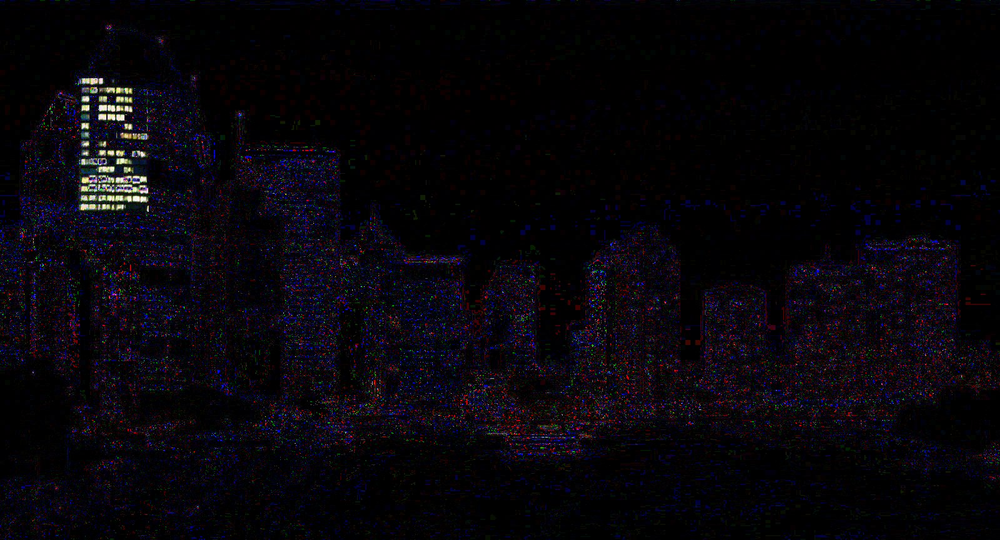

# Intro to Stegano 2

**Author**: `Managarmr`

## Table of Contents

1. [Challenge](#1-challenge)
2. [Having a look](#2-having-a-look)
3. [Mitigations](#3-mitigations)

## 1. Challenge

**Category**: `Stegano`  
**Difficulty**: `Baby`  
**Author**: `explo1t`  
**Attachments**: [chall.jpg](https://static.allesctf.net/challenges/1f5a66bf2ec44f29a3364c29d7c935426db2e62d38b855a059d68066782ad378/chall.jpg)  
**Description**:

This is an introductory challenge for the almighty steganography challenges. The
three stages contain very different variants of hidden information. Find them!

## 2. Having a look

We are provided with an image it appears. There don't seem to be any interesting
strings within the image - so let's just search for the original online. This
turns out to be really easy thanks to the magic that is reverse image search.

Comparing the two images by `xor`'ing them using `stegsolve` returns an
interesting image:

The same area in the `chall.jpg` looks like binary and indeed it decodes into
a flag:

`CSCG{a_Fl4g}`

## 3. Mitigations

There is no point in talking about mitigation in stegano challenges.
I suppose you could generate pictures which can not be found online.
