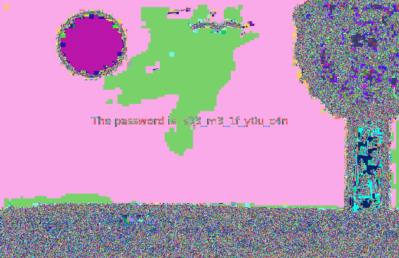

# Intro to Stegano 3

**Author**: `Managarmr`

## Table of Contents

1. [Challenge](#1-challenge)
2. [Having a look](#2-having-a-look)
3. [Mitigations](#3-mitigations)

## 1. Challenge

**Category**: `Stegano`  
**Difficulty**: `Baby`  
**Author**: `explo1t`  
**Attachments**: [chall.png](https://static.allesctf.net/challenges/d7c830d9a20e40da32c8839c33d6bc2f44e2c468a7a631753bd7cccd2779e040/chall.png)  
**Description**:

This is an introductory challenge for the almighty steganography challenges. The
three stages contain very different variants of hidden information. Find them!

## 2. Having a look

We are provided with a homemade image it appears. There don't seem to be any
interesting strings within the image - so let's look at it in `stegsolve`.

And fair enough - we are able to read a hidden password:

`s33_m3_1f_y0u_c4n`

Using `steghide` doesn' prove useful, but `binwalk` is able to extract an
encrypted zip archive, which we are able to decrypt using the password.

Resulting in the flag: `CSCG{H1dden_1n_pla1n_s1ght}`

## 3. Mitigations

There is no point in talking about mitigation in stegano challenges.
I suppose you could share your password securely out-of-band.
