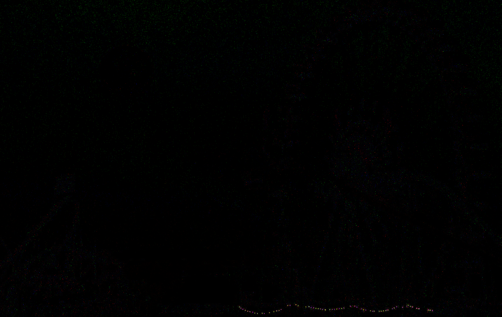

# Matrix

**Author**: `Managarmr`

## Table of Contents

1. [Challenge](#1-challenge)
2. [Having a look](#2-having-a-look)
3. [Mitigations](#3-mitigations)

## 1. Challenge

**Category**: `Stegano`  
**Difficulty**: `Hard`  
**Author**: `explo1t`  
**Attachments**: [matrix.7z](https://static.allesctf.net/challenges/08fad35b8282bce116d3e01792f30aeb48d9e8250bea190a89bf26dcddc262ad/matrix.7z)  
**Description**:

Thｉs is ｙouｒ last chaｎcｅ. Afｔｅr this, there is no turning back. You take the blue pill, the story ends, you wake up in your bed and believe whatever you want to believe. You take the red pill, you stay in Wonderland, and I show you how deep the rabbit hole goes. Remember, all I'm offering is the flag. Nothing more.

## 2. Having a look

We are provided with a 7zip archive containing a single `wav` file:

```
$ 7z l matrix.7z 

7-Zip [64] 16.02 : Copyright (c) 1999-2016 Igor Pavlov : 2016-05-21
p7zip Version 16.02 (locale=en_US.UTF-8,Utf16=on,HugeFiles=on,64 bits,24 CPUs AMD Ryzen 9 3900X 12-Core Processor             (870F10),ASM,AES-NI)

Scanning the drive for archives:
1 file, 15809998 bytes (16 MiB)

Listing archive: matrix.7z

--
Path = matrix.7z
Type = 7z
Physical Size = 15809998
Headers Size = 146
Method = Delta LZMA2:48m
Solid = -
Blocks = 1

   Date      Time    Attr         Size   Compressed  Name
------------------- ----- ------------ ------------  ------------------------
2020-03-06 11:44:49 ....A     34436280     15809852  matrix.wav
------------------- ----- ------------ ------------  ------------------------
2020-03-06 11:44:49           34436280     15809852  1 files
```

The `wav` file itself does not suspicious until you look at the spectral form.
In this form you can clearly make out a password: `Th3-R3D-P1ll?`

Using this password we an extract a file called `redpill.jpg` using `steghide`.
Looking up the original through the magic of reverse image search we can xor it
using `stegsolve` we can see something interesting is going on with the fairy
lights in the bottom right:



Which quite obviously is a bitstring whereas blue represents a `0` and green
represents a `1`, resulting in the password: `n!C3_PW?`.

Using this password we can decrypt an encrypted zip archive which we obtain by
running `binwalk` on `redpill.jpg`.

The archive contains a `secret.txt` file with the content of
`6W6?BHW,#BB/FK[?VN@u2e>m8` which at first glance looks like it is a
substitution cipher for `CSCG{...}` but as it turns out this is just the
`base85` encoding of the flag `CSCG{St3g4n0_M4s7eR}`

## 3. Mitigations

There is no point in talking about mitigation in stegano challenges.
I suppose you could share your password securely out-of-band and generate images
of which no originals to be found online exist.
